<p align="center">
  
</p>

<h1 align="center">Material Symbols for Compose Multiplatform</h1>

<p align="center">A single <code>MaterialSymbol</code> composable over Google's 3 official variable icon fonts (Outlined, Rounded, Sharp) — with a build-time-generated, typo-proof catalog of every valid icon name, and live control over weight, grade, optical size and fill.</p>

<p align="center">
  <a href="https://search.maven.org/search?q=g:dev.catbit+a:material-symbols"></a>
  
  
  
  
</p>

<p align="center">
  <a href="https://rodrigoferreira001.github.io/MaterialSymbols/">
    
  </a>
  <br />
  <sub>Every icon, filterable by weight, grade, optical size, style and category — running in the browser</sub>
</p>

---

## The same app, everywhere

One `MaterialSymbol` composable, one shared MVI ViewModel — Android, Desktop and Web all rendering pixel-identical UI, light and dark, from the exact same Kotlin. No platform-specific screens to keep in sync.

<table>
<tr>
  <th></th>
  <th>Light</th>
  <th>Dark</th>
</tr>
<tr>
  <td><b>Desktop</b><br /><sub>JVM, native window</sub></td>
  <td>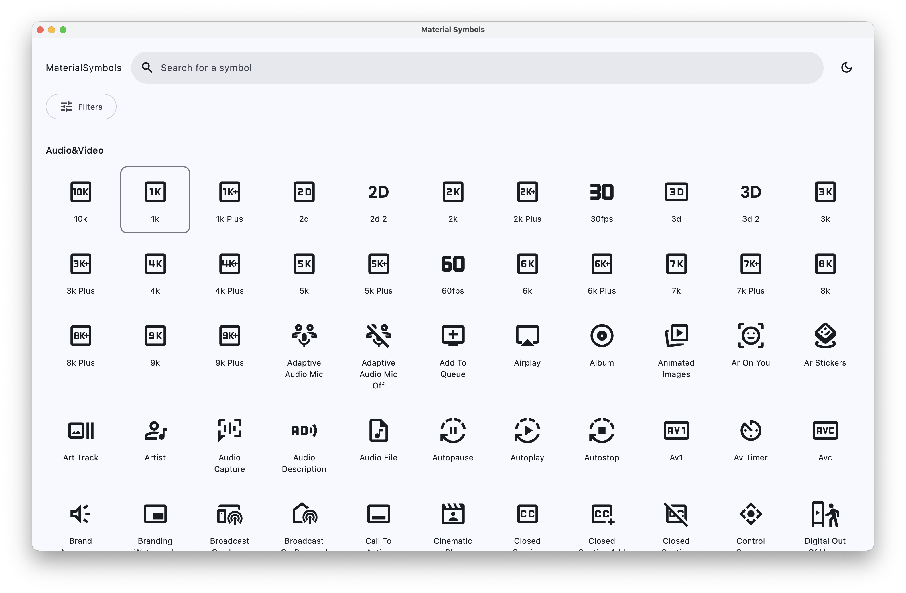</td>
  <td>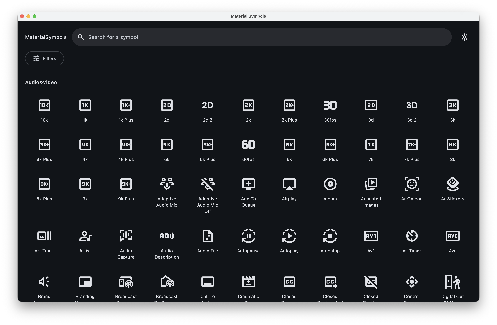</td>
</tr>
<tr>
  <td><b>Web</b><br /><sub>wasmJs, in the browser</sub></td>
  <td>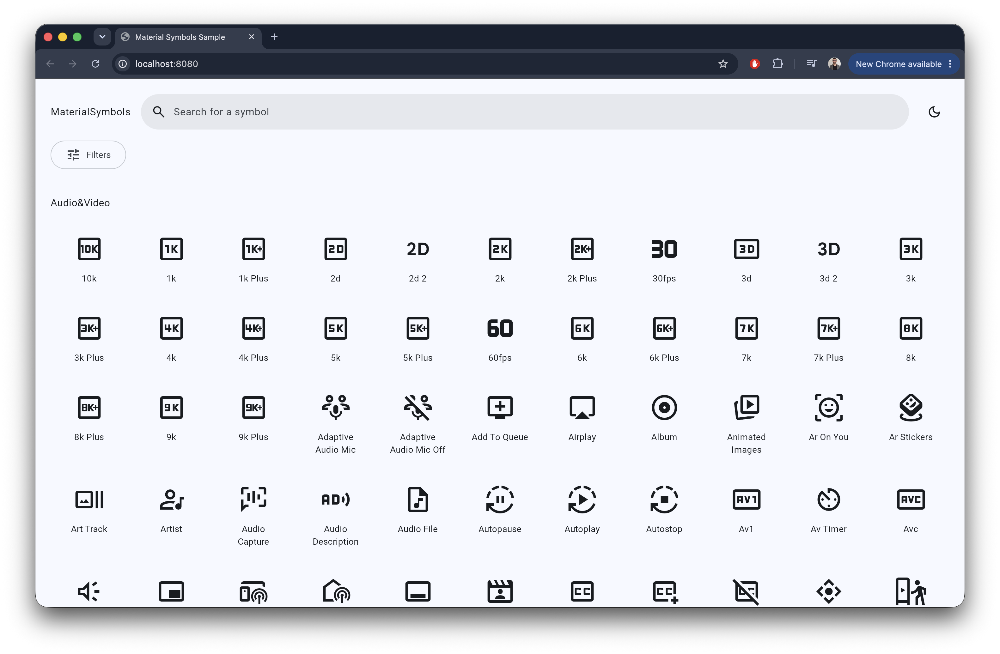</td>
  <td>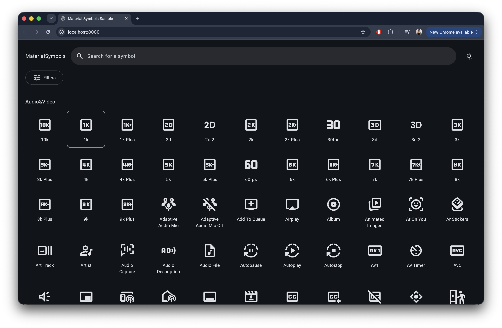</td>
</tr>
<tr>
  <td><b>Android</b></td>
  <td>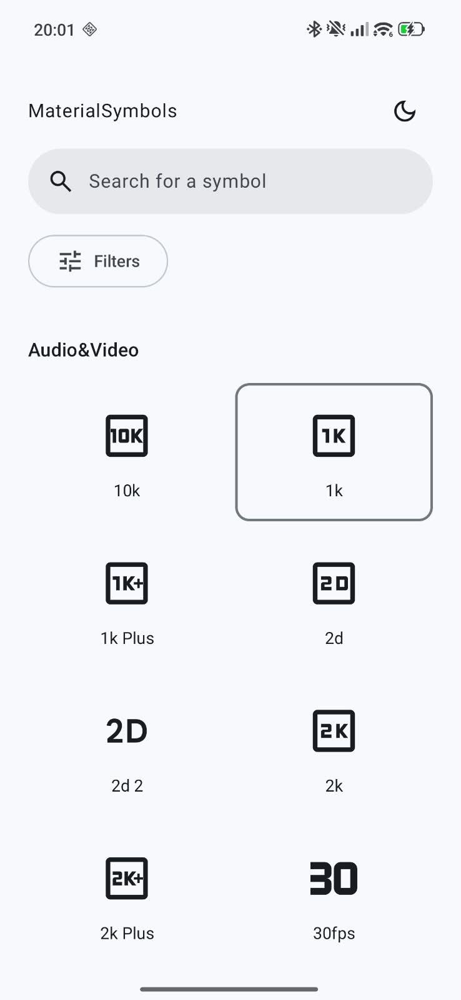</td>
  <td>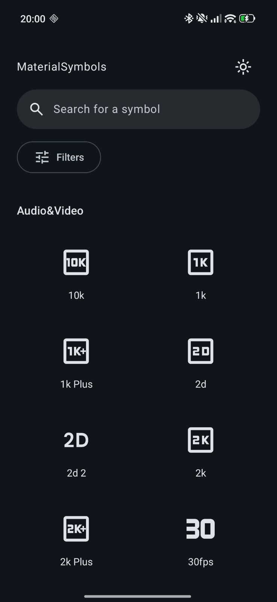</td>
</tr>
</table>

<details>
<summary><b>More screens</b> — the filter panel and the per-icon preview, on every platform</summary>
<br />

**Filters** — fill, weight, grade, optical size, style and category, all live:

<table>
<tr>
  <td>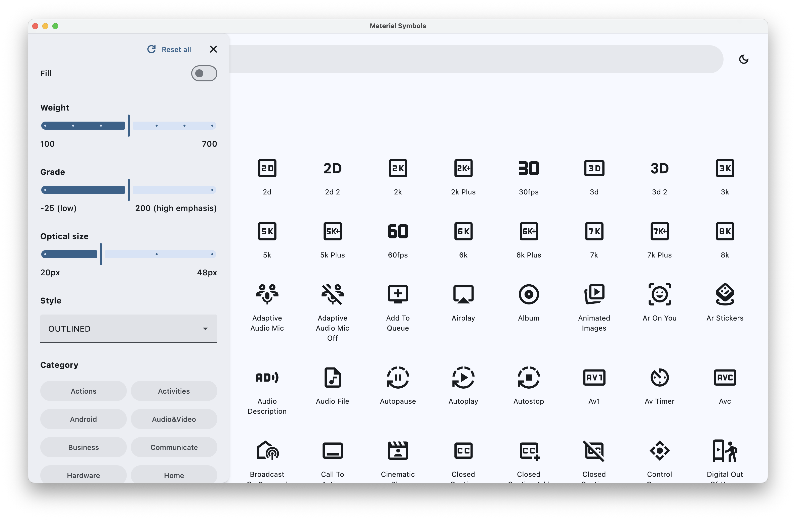</td>
  <td>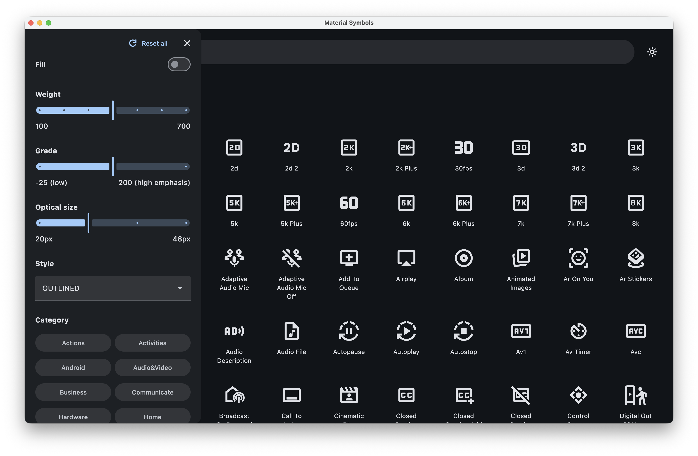</td>
  <td>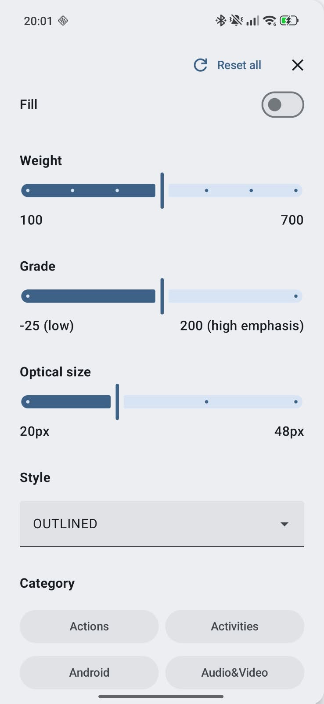</td>
  <td>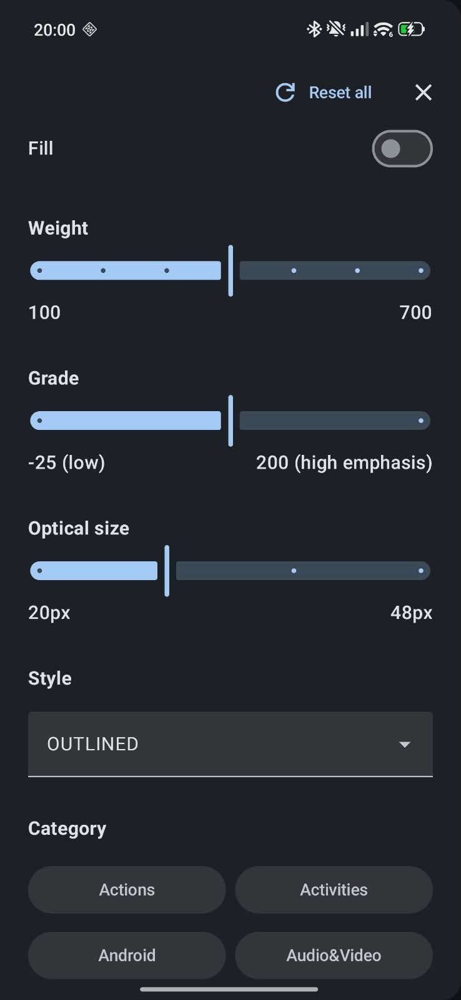</td>
</tr>
</table>

**Preview** — size, a hex-validated color field and a Google-Fonts-style color picker:

<table>
<tr>
  <td>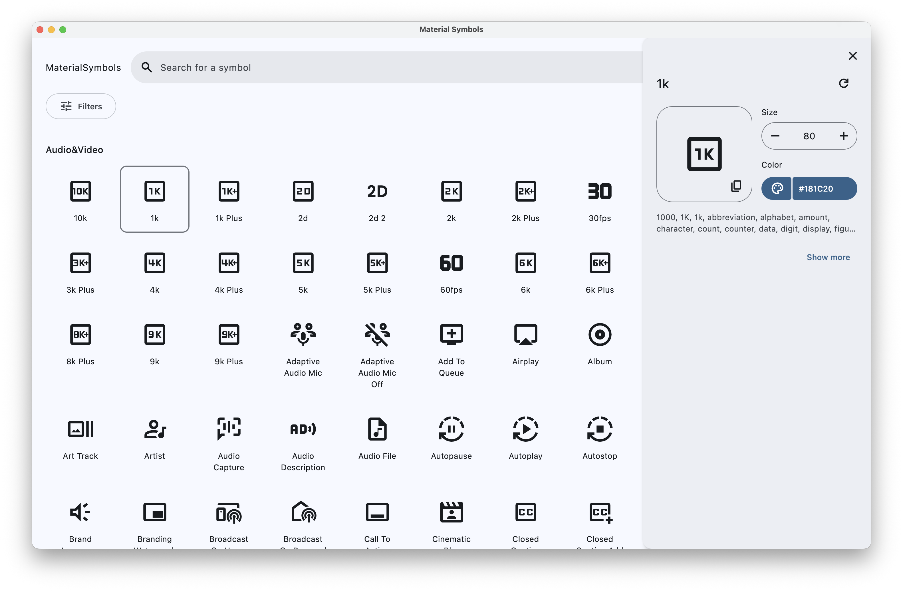</td>
  <td>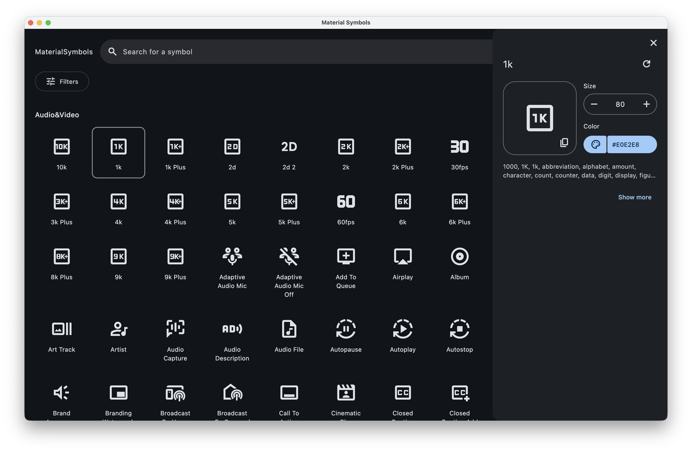</td>
  <td>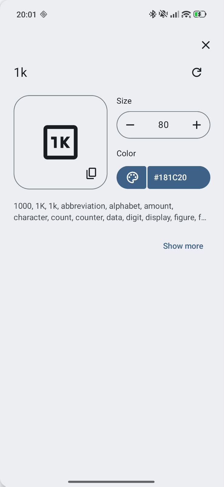</td>
  <td>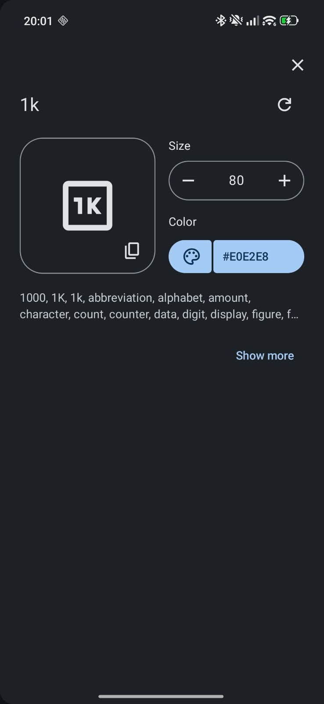</td>
</tr>
</table>

Web has the same two panels — [see them live](https://rodrigoferreira001.github.io/MaterialSymbols/) instead of a screenshot.

</details>

## The problem

Google's [Material Symbols](https://fonts.google.com/icons) aren't a fixed set of vector drawables — they're **variable fonts**. A single glyph carries 4 tunable axes (fill, weight, grade, optical size), and Google ships 3 separate font families (Outlined, Rounded, Sharp) on top of that. Wiring this up by hand in Compose means juggling `FontFamily`s, `FontVariation.Settings`, raw icon-name strings that silently render blank on a typo, and — on web specifically — a font that loads *asynchronously*, which without care means a flash of unstyled text before the glyph appears.

This library collapses all of that into one composable and one generated, compile-time-checked catalog.

## Usage

```kotlin
MaterialSymbolsRenderingScope {
    MaterialSymbol(
        iconName = MaterialSymbols.SETTINGS,
        contentDescription = "Settings",
        style = MaterialSymbolStyle.ROUNDED,
        filled = true
    )
}
```

- `MaterialSymbolsRenderingScope` loads the 3 icon fonts once and provides them to every `MaterialSymbol` composed underneath it — wrap the root of your UI tree in it, once.
- `MaterialSymbols` is generated from Google's live icon catalog — `MaterialSymbols.SETTINGS`, `MaterialSymbols.HOME`, and so on for every one of the 3905 icons Material Symbols publishes across all 3 families. Typo a name and the **build fails**, instead of silently rendering a blank glyph at runtime.

## Configuring how icons look

Weight, grade and optical size are real OpenType variable-font axes (`wght`, `GRAD`, `opsz`), not cosmetic props — they're the same mechanism variable text fonts use, applied to icons instead of letterforms. `MaterialSymbolFontsConfig` exposes them:

```kotlin
MaterialSymbolsRenderingScope(
    config = MaterialSymbolFontsConfig(
        weight = FontWeight(500),  // 100 (thin) .. 700 (bold) — stroke thickness
        grade = 200,               // -25 .. 200   — fine weight trim that doesn't reflow layout
        opticalSize = 24.sp        // 20 .. 48      — redraws detail for the size it's shown at
    )
) {
    MaterialSymbol(
        iconName = MaterialSymbols.FAVORITE,
        contentDescription = "Favorite",
        filled = true
    )
}
```

| Axis | Range | What it actually does |
|---|---|---|
| **weight** | 100 – 700 | Stroke thickness, like a text font's weight. |
| **grade** | -25 – 200 | A weight *trim* that keeps the glyph's box size fixed — use it to compensate contrast (e.g. slightly bolder on a dark background) without anything else in the layout shifting. |
| **optical size** | 20 – 48 | The glyph is redrawn for the size it renders at, not just scaled — small icons stay legible, large icons pick up detail a naive scale-up would blur. |
| **filled** | on / off | Toggles the `FILL` axis — outlined vs. solid glyph. |
| **style** | Outlined / Rounded / Sharp | Which of the 3 font families to draw from — this one *is* a separate font, not an axis. |

Play with all 5 live in the [showcase](https://rodrigoferreira001.github.io/MaterialSymbols/) — the sliders there map 1:1 to this config.

## Install

```kotlin
// settings.gradle.kts
dependencyResolutionManagement {
    repositories {
        mavenCentral()
    }
}
```

```kotlin
// build.gradle.kts
dependencies {
    implementation("dev.catbit:material-symbols:1.0.0")
}
```

Targets Android, iOS (`iosArm64`/`iosSimulatorArm64`), JVM/Desktop and Web (`wasmJs`) — pick whichever of those your Compose Multiplatform module already targets, nothing extra to configure per-platform.

## Under the hood

Two things in this repo that go a bit further than "wrap a font in a composable":

- **The icon catalog is generated, not hand-maintained.** A custom Gradle plugin (`build-logic/material-symbols-codegen`) fetches Google's live icon metadata endpoint at build time, filters it down to the exactly 3905 icons available in all 3 font families, and emits `MaterialSymbols` as plain `const val String`s (an `enum` blew past the JVM's 64KB-per-method bytecode limit at this size). A bundled snapshot is the fallback if the network call fails, so the build never breaks offline.
- **The web target gets its own font-loading path.** `Font()` loads synchronously on JVM/Android/iOS but *asynchronously* on Wasm/JS — an early version of this library memoized the built font family too eagerly and froze it at its pre-load state on web only, rendering icon names as raw text. The fix is an `expect`/`actual` split: web uses Compose's `preloadFont()` API for a real fix, every other platform shares one synchronous implementation.

## Running the sample

`material-symbols-sample` is the icon browser behind the [live showcase](https://rodrigoferreira001.github.io/MaterialSymbols/) — search, filter by weight/grade/optical size/style/category, and preview any icon, built as a small MVI app (`State`/`Event`/`Effect` + a `ViewModel`) on top of the library.

```bash
# Desktop
./gradlew :material-symbols-sample:desktopApp:run

# Web (wasmJs)
./gradlew :material-symbols-sample:webApp:wasmJsBrowserDevelopmentRun

# Android — open the project in Android Studio and run the androidApp configuration, or:
./gradlew :material-symbols-sample:androidApp:installDebug
```

## License

Apache License 2.0 — see [LICENSE](LICENSE).
